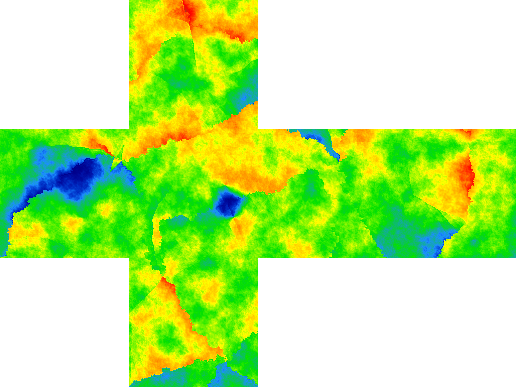

# ris_terrain_generator

This repo generates heightmaps for a planet.

## Dependencies

To compile and run this repo, you require a working Rust compiler: https://www.rust-lang.org/tools/install

## How to run

    git clone https://github.com/Rismosch/ris_terrain_generator.git
    cd ris_terrain_generator
    cargo run -r

## How to use

The main and only entry point is `terrain_generator::run`. It produces the 6 square faces of a cube. These then can be mapped to a sphere, thus producing planetary terrain.

`terrain_generator::Args` exposes a few settings to modify the generators behaviour:

- `only_generate_first_face` is for debugging purposes. When tweaking the generation algorithm, which may provide poor performance, it may be helpful to only generate the first face to save time.
- `seed` is a wrapper around a `u128`, which controls the RNG of the generator. The same seed will produce the same terrain. `Seed::new()` generates a completely new and unique seed, which in turn generates completely new terrain. `Seed::default()` on the other hand returns a hard coded, unchanging seed. Use `Seed::default()` or `Seed(your_number)` to generate the same terrain again and again.
- `width` is the width of a single cube face. This has a small effect on the overall structure of the terrain. It affects the continent generation, but aside from that it increases resolution. Note that the bigger the width, the longer the generator takes. At sufficiently large widths, generation can take up to minutes and hours.
- `continent_count` determines how many continents should be generated. These are used to generate very coarse terrain features.
- `kernel_radius` has an effect on the width of coarse continental mountain ranges. A higher radius produces thicker mountains, but massively increases generation time.
- `fractal_main_layer` describes which octave of the fractal perlin noise is the main one. Every other will be weighted less than the main layer.
- `fractal_weight` determines the weight of the total fractal perlin noise. The coarse continent terrain has a weight of 1.

`terrain_generator::run` returns a `Vec` of the generated sides. These resulting heightmaps are normalized. This means all values will be between 0 and 1. This makes it easy to transform them into any format you desire. As an example, `save_as_qoi` in `main.rs` demonstrates how to convert these values into [qoi images](https://qoiformat.org/), and save them to the root of this repository.

To find `i` to index a pixel in a heightmap, use the following formula:

    i = x + y * width

where `x` and `y` are your coordinates, and `width` is the width you provided in `terrain_generator::Args`.

As for coordinate system and orientation, the origin (0, 0) of each face is in the upper left corner. +x is facing right, and +y is facing down. The faces are arranged like this:

where

- L => left
- B => back
- R => right
- F => front
- U => up/top
- D => down/bottom

## How it works

The terrain is generated in 3 distinct steps:

- continent generation
- fractal perlin noise
- hydraulic erosion

Continent generation produces continents. It picks random points on the surface of the cube. One point for each continent. Then it grows these continents using a randomized breadth-first search until the whole cube is covered.

After the continents have been generated, a convolution with a kernel over the entire cube is performed. This is to find the continental boundaries, the nearest touching continent of each pixel. Each continent is assigned a random rotation axis. To simulate continental drift, the rotation axis is used to find in which direction each pixel is moving in. Then, depending whether neighboring continents collide or diverge, the pixel is raised or lowered.

Continent generation generates highly coarse terrain, but doesn't create fine details, especially at continent centers. So in the next step [fractal perlin noise](https://en.wikipedia.org/wiki/Perlin_noise) is used to generate noise over the entire cube surface.

While the previous steps already produce quite nice looking terrain, it can still be improved.

First, between generation steps, the heightmaps are normalized between 0 and 1. Second, a weighting function is applied, making some heights more likely than others. Then, hydraulic erosion is applied. Continent generation is very coarse and the fractal noise is very smooth, which are the both extremes on the detail spectrum. Hydraulic erosion ties these two together, while forming the terrain in a much mroe natural way:

Rain is simulated, by placing waterdroplets randomly on the surface of the terrain. The water then flows downhill, carrying sediment with it and depositing it somewhere else. This cuts grooves and rivers into the terrain, making mountain peaks sharper and valleys flatter.

Since the 6 faces tile the cube, great care must be taken at the edges of each face. The randomized breadth-first search, convolution and erosion take this into account, as they walk over the cube surface. The perlin noise in particular had to be modified to generate continuous values over edges. 

A finished heightmap, with a colored gradient applied, may look like this:

## Notes

The code started out as a script in [ris_engine](https://github.com/Rismosch/ris_engine). Most code in this repo was copied from my engine and modified, such that it compiles as a standalone project.

The idea is to run this generator once, and then use the static asset in the engine. Thus, the comparably poorer code quality and performance isn't of great significance, as the intention of this code is to be run once and then never again.

Have fun!
