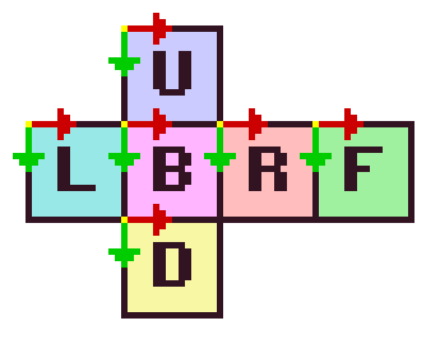

# ris_terrain_generator

This repo generates heightmaps for a planet.

## Dependencies

To compile and run this repo, you require a working Rust compiler: https://www.rust-lang.org/tools/install

## How to run

    git clone https://github.com/Rismosch/ris_terrain_generator.git
    cd ris_terrain_generator
    cargo run -r

## How to use

The main and only entry point is `terrain_generator::run`. It produces the 6 square faces of a cube. These can then be mapped to a sphere, thus producing planetary terrain. An example usage can be found in `main.rs`.

`terrain_generator::run` returns a `Vec` of the generated sides. These resulting heightmaps are normalized. This means all values will be between 0 and 1. This makes it easy to transform them into any format you desire. As an example, `save_as_bin` and `save_as_qoi` in `main.rs` demonstrate how one might use the heightmaps. ⚠ **Note that these examples save files at the root of this repo! Existing files will be overwritten! Make sure you create backups of the generated files you want to keep!**

To find `i` to index a pixel in a heightmap, use the following formula:

    i = x + y * width

where `x` and `y` are your coordinates, and `width` is the width you provided in `terrain_generator::Args`.

As for coordinate system and orientation, the origin (0, 0) of each face is in the upper left corner. +x is facing right, and +y is facing down. The faces are arranged like this:

where

- L => left
- B => back
- R => right
- F => front
- U => up/top
- D => down/bottom

## How it works

The terrain is generated in 3 distinct steps:

- continent generation
- fractal perlin noise
- hydraulic erosion

Continent generation produces continents. It picks random points on the surface of the cube. One point for each continent. Then it grows these continents using a randomized [breadth-first search](https://en.wikipedia.org/wiki/Breadth-first_search) until the whole cube is covered.

After the continents have been generated, a [convolution](https://en.wikipedia.org/wiki/Convolution) with a [kernel](https://en.wikipedia.org/wiki/Kernel_(image_processing)) over the entire cube is performed. This is to find the [continental boundaries](https://en.wikipedia.org/wiki/List_of_tectonic_plate_interactions), the nearest touching continent of each pixel. Each continent is assigned a random [rotation axis](https://en.wikipedia.org/wiki/Axis%E2%80%93angle_representation). To simulate continental drift, the rotation axis is used to find the direction, in which each pixel is moving in. Then, depending whether neighboring continents collide or diverge, the pixel is raised or lowered.

Continent generation generates highly coarse terrain, but doesn't create fine details, especially at continent centers. So in the next step [fractal perlin noise](https://en.wikipedia.org/wiki/Perlin_noise) is used to generate noise over the entire cube surface.

While the previous steps already produce quite nice looking terrain, it can still be improved.

First, between generation steps, the heightmaps are [normalized](https://en.wikipedia.org/wiki/Normalization_(statistics)) between 0 and 1. Second, a weighting function is applied, making some heights more likely than others.

Then, [hydraulic erosion](https://en.wikipedia.org/wiki/Hydraulic_action) is applied. This combines the two previous steps and forms the terrain in a much more natural way: Rain is simulated, by placing waterdroplets randomly on the surface of the terrain. The water then flows downhill, carrying sediment with it and depositing it somewhere else.

The erosion simulator logic was directly taken from [Sebastian Lague](https://youtu.be/eaXk97ujbPQ) (precicely [this](https://github.com/SebLague/Hydraulic-Erosion/blob/f245576d204978e3186f41c8abbd75c326c6857e/Assets/Scripts/ComputeShaders/Erosion.compute) code), rewritten in Rust and heavily modified to work on a cube.

Since the 6 faces tile the cube, great care must be taken at the edges of each face. The randomized breadth-first search, convolution and erosion take this into account, as they walk over the cube surface. The erosion in particular required the kernel and the direction to be rotated, aswell as sampling over the edges. The perlin noise in had to be modified such that it's lattice directions are continuous over the edges. But due to the [Hairy ball theorem](https://en.wikipedia.org/wiki/Hairy_ball_theorem), the 8 corners produce no directions for the perlin noise, or in other words, directions with 0 length.

A finished heightmap, with a colored gradient applied, may look like this:

And rendered applied to a sphere mesh using cube topology, it may look like this:

_todo!()_

## Settings

`terrain_generator::Args` exposes a few settings to modify the generators behaviour:

- `seed` is a wrapper around a `u128`, which controls the RNG of the generator. The same seed will produce the same terrain. `Seed::new()` generates a completely new and unique seed, which in turn generates completely new terrain. `Seed::default()` on the other hand returns a hard coded, unchanging seed. Use `Seed::default()` or `Seed(<your_number>)` to generate the same terrain again and again.

- `width` is the width of a single cube face. This has a small effect on the overall structure of the terrain. It affects the continent generation, but aside from that it increases resolution. Note that the bigger the width, the longer the generator takes. At sufficiently large widths, generation can take up to minutes and hours.

- `continent_count` determines how many continents should be generated. These are used to generate very coarse terrain features.

- `kernel_radius` has an effect on the width of coarse continental mountain ranges. A higher radius produces thicker mountains, but massively increases generation time.

- `fractal_main_layer` describes which octave of the fractal perlin noise is the main one. Every other will be weighted less than the main layer.

- `fractal_weight` determines the weight of the total fractal perlin noise. The coarse continent terrain has a weight of 1.

- `erosion_iterations` determines how long the erosion lasts. a single iteration spawns a raindrop for every pixel. thus more iterations drastically increase how many raindrops are simulated.

- `erosion_max_lifetime` determines how many steps a raindrop lives at maximum, before simulating a new and different raindrop.

- `erosion_start_speed` sets the initial speed of the raindrop.

- `erosion_start_water` sets how much water water a raindrop has initially.

- `erosion_inertia` determines how hard it is to change the direction the droplet is moving in. This means a droplet may not always flow down the steepest slope, but may overshoot and land somewhere else.

- `erosion_min_sediment_capacity` determines the minimum amout of material the raindrop can hold.

- `erosion_sediment_capacity_factor` has an affect on how much material a raindrop can hold.

- `erosion_erode_speed` has a direct effect on how much material is removed from the terrain.

- `erosion_deposit_speed` has a direct effect on how much material the raindrop loses when depositing it back to the terrain. (For example when the raindrop evaporates, it leaves the material behind.)

- `erosion_gravity` determines how fast the droplet accelerates downwards.

- `erosion_evaporate_speed` sets how much water the raindrop loses, after each time a single step is evaluated.

## Notes

The code started out as a script in [ris_engine](https://github.com/Rismosch/ris_engine). Most code in this repo was copied from my engine and modified, such that it compiles as a standalone project. Due to that, and the fact that `terrain_generator.rs` went through many prototypes very very quickly, the code is in comparably poorer quality.

However, the idea is to run this generator once, and then use the result as a static asset. Thus, the comparably poorer code quality and performance isn't of great significance, because it will never be run again.

Anyway, have fun!
